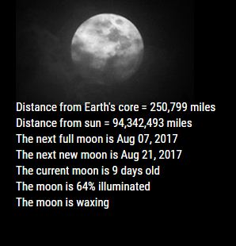
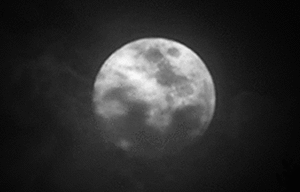
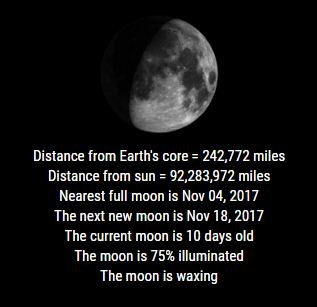

## MMM-Lunartic

Up to the minute information about our Lunar partner, with a splash of EyeCandy, to boot!

## How it works

First, you have three choices of images to accompany the data.

* A rather impressive animation of the night moon, with clouds rolling by
* Updating minutely, an image of the actual appearance of the current moon
* A static image of all the phases of the moon

Then you are offered updated information every minute, such as:

* The distance of the moon from the Earth's core at this moment. (Changes minutely)
* This distance of the moon to the sun at this moment. (Changes minutely)
* The date of the next full moon. (Very important if you're a werewolf!)
* The date of the next new moon. (Also very important if you're a werewolf!)
* The age of the current moon's monthly phase. 
* Percentage of the current moon that is illuminated.
* The stage of the present moon (waning, waxing, etc..) 

## Examples

The moon will be animated. See picture below.

* The animation can be hidden if only the information is wanted.

 * This can be hidden

 * To show only this, or vice versa, showing just the image

* Or, Updating minutely, an image of the actual appearance of the current moon

* Annotated .css file included for aligning and coloring text and header.

## Installation

* `git clone https://github.com/mykle1/MMM-Lunartic` into the `~/MagicMirror/modules` directory.

* No API key needed! (It's my API) No dependencies needed! No kidding!

## Config.js entry and options

    {
        module: 'MMM-Lunartic',
        position: 'top_left',                   // Best in left, center, or right regions
        config: { 
			image: "animation",                     // animation, current, DayNight or static
			distance: "miles",                      // miles or km
			useHeader: false,                       // true if you want a header
			header: "The Lunartic is in my head",   // Any text you want
			maxWidth: "300px",
			animationSpeed: 3000,                   // updated info fades in and out
        }
    },
	

## Special thanks to SpaceCowboysDude for spotting my errors, as usual.
